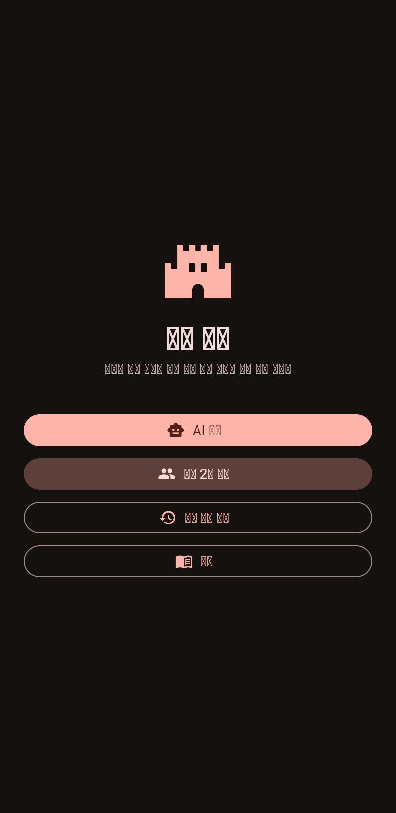
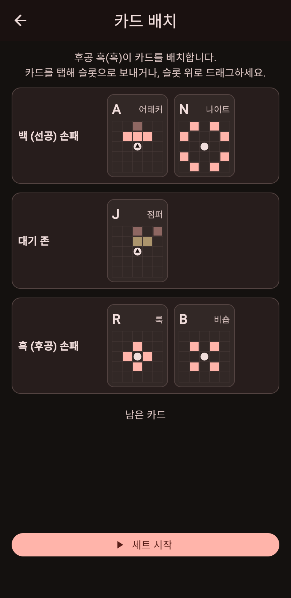
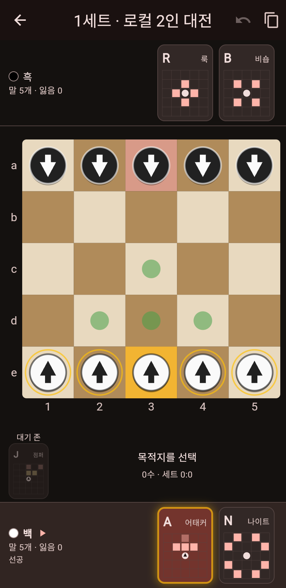
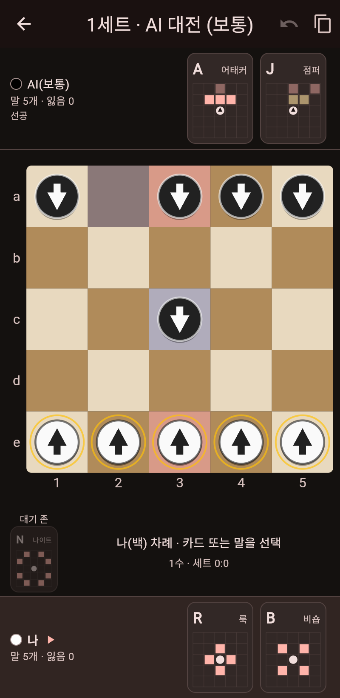

# 카드 체스 (Card Chess)

피의 게임 파이널 3라운드 **카드 체스**를 Flutter 앱으로 구현한 프로젝트. iOS / Android / Web.

| 홈 | 카드 배치 | 대전 | AI 대전 |
|---|---|---|---|
|  |  |  |  |

## 기능

- 로컬 2인 대전 (한 기기에서 번갈아 플레이), 3세트 매치
- AI 대전 (쉬움 / 보통 / 어려움) — 네가맥스 + 알파베타 탐색, 카드 배치까지 AI가 결정
- 후공의 카드 배치 화면 (탭 / 드래그)
- 원작 기보(1세트 23수, 2세트 22수) 재생
- 기보 복사(텍스트), 무르기, 규칙 화면
- 하우스룰 옵션(엔진): 점퍼가 상대 말을 넘을 수 있는지, 착수 불가 시 처리

## 구조

```
lib/
├── engine/        순수 Dart 게임 엔진 (Flutter 의존 없음)
│   ├── model.dart          말/카드/좌표/착수/규칙 옵션
│   ├── move_gen.dart       카드별 합법 수 생성
│   ├── game_state.dart     불변 게임 상태, 착수 적용, 승리 판정
│   ├── kifu.dart           기보 파서/직렬화
│   ├── original_games.dart 원작 기보 픽스처
│   ├── match.dart          3세트 매치
│   └── ai.dart             AI
├── state/game_controller.dart   화면 상태 + AI 턴 스케줄링
└── ui/            홈 / 카드 배치 / 대전 / 기보 재생 / 규칙
test/
├── engine/        기보 재생·이동 규칙·무작위 플레이 불변식·AI 테스트
└── widget_test.dart
```

자세한 설계와 룰 해석은 [docs/PLAN.md](docs/PLAN.md) 를 참고.

## 개발

```bash
flutter pub get
flutter test            # 엔진 + 위젯 테스트
flutter analyze
flutter run -d chrome   # 웹으로 실행
```

## 빌드 / 배포 (GitHub Actions)

| 워크플로우 | 러너 | 결과물 |
|---|---|---|
| `ci.yml` | ubuntu | 분석·테스트, 웹 빌드, Android APK 아티팩트 |
| `ios.yml` | macos | 서명 없는 IPA / 시뮬레이터 앱. 시크릿 설정 시 서명 IPA + TestFlight |
| `pages.yml` | ubuntu | GitHub Pages 웹 배포 (Settings → Pages → Source: GitHub Actions) |

맥 없이 iPhone 빌드를 만드는 절차는 [docs/IOS_BUILD.md](docs/IOS_BUILD.md) 참고.
